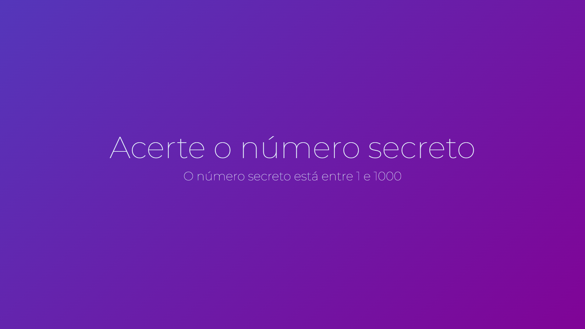

<h1 align="center"> Número Secreto </h1>

Projeto Número Secreto desenvolvido na Alura 

  <a href="#-tecnologias">Tecnologias</a>&nbsp;&nbsp;&nbsp;|&nbsp;&nbsp;&nbsp;
  <a href="#-projeto">Projeto</a>&nbsp;&nbsp;&nbsp;|&nbsp;&nbsp;&nbsp;
  <a href="#-deploy">Deploy</a>

  

 

  

## 🚀 Tecnologias

Esse projeto foi desenvolvido com as seguintes tecnologias:

- HTML 
- CSS
- JavaScript
- Speech Recognition API
- Git e Github

## 💻 Projeto

Projeto realizado durante o curso de JavaScript: validações e reconhecimento de voz. O principal objetivo foi criar um jogo interativo capaz de reconhecer a voz do usuário e validar se o chute foi correto. Esta iniciativa integrou conceitos de validação de dados e uso da API de Reconhecimento de Fala do navegador, proporcionando uma experiência de aprendizado prática e envolvente. O projeto demonstra habilidades em desenvolvimento web, combinando aspectos de interatividade e funcionalidade avançada com foco na experiência do usuário.

## 🚀 Deploy
- [Acesse o projeto finalizado, online](https://rudyfernandes.github.io/numero-secreto/)

